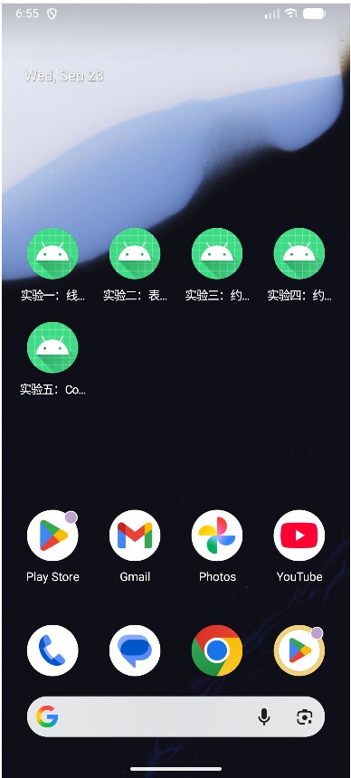
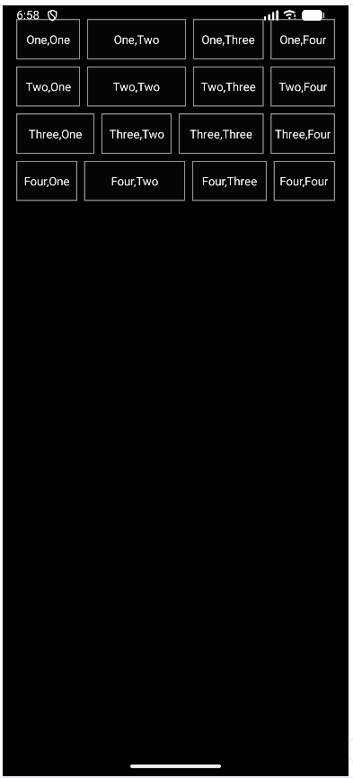

# 移动软件开发实验报告

## 实验二：Android 界面布局

### 一、实验目的

1. 理解 Android 界面中 `View`、`ViewGroup` 与布局容器之间的关系。
2. 掌握使用 XML 编写 Android 界面布局以及通过 `setContentView()` 加载布局的方法。
3. 掌握 `LinearLayout` 的排列方向、布局嵌套和 `layout_weight` 权重分配。
4. 掌握 `TableLayout` 与 `TableRow` 的行列组织、列拉伸和单元格跨列。
5. 掌握 `ConstraintLayout` 的水平约束、垂直约束、相对位置和链式布局。
6. 掌握将图片放入 `res/drawable` 并在 XML 布局中引用的方法。
7. 掌握 Jetpack Compose 中 `Column`、`Row`、`LazyColumn` 和状态管理的基本用法。
8. 学会为多个小实验分别创建 Activity，并配置为相互独立的启动入口。

### 二、实验内容

根据《实验2_Android界面布局.pdf》的要求，本次实验完成以下内容：

- 使用 `LinearLayout` 实现四行四列的文字布局，不同行中的单元格采用不同宽度比例。
- 使用 `TableLayout` 实现带标题、菜单名称、快捷键和分隔线的表格式菜单界面。
- 使用 `ConstraintLayout` 实现包含输入提示、显示区域和四行按键的计算器界面。
- 使用 `ConstraintLayout` 和实验提供的图片资源实现航班选择界面。
- 使用 Jetpack Compose 实现课程学习任务列表。
- 实现任务添加、完成状态切换、删除、完成数量统计和完成文字删除线效果。
- 为五个小实验分别创建独立 Activity，并在应用清单中配置五个启动入口。
- 对布局 XML、样式、字符串、图片资源及 Activity 之间的对应关系进行检查。

### 三、实验环境

| 环境或工具 | 配置 |
| --- | --- |
| 操作系统 | Windows |
| 开发工具 | Android Studio3 |
| 开发语言 | Kotlin 2.2.10、XML |
| UI 技术 | Android View 布局 + Jetpack Compose Material 3 |
| Android Gradle Plugin | 9.3.3 |
| Gradle | 9.5.0 |
| Gradle JVM / JDK | JDK 25 |
| Java 源码兼容版本 | Java 11 |
| Compile SDK / Target SDK | API 37 |
| Min SDK | API 24 |
| ConstraintLayout | 2.2.1 |
| Compose BOM | 2026.02.01 |
| 测试设备 | 模拟器 |

### 四、实验过程

#### 1. 分析实验要求并规划工程结构

首先阅读课程资料《3-Android布局.pdf》，复习 `LinearLayout`、`TableLayout`、`ConstraintLayout` 和 Jetpack Compose 的布局方法，再对照《实验2_Android界面布局.pdf》中的目标界面拆分实验任务。

由于每个小实验需要独立启动，本工程没有使用一个页面切换所有实验，而是分别建立五个 Activity。前四个实验使用 XML 编写布局，第五个实验按照题目要求使用 Compose 编写界面。

项目中与本次实验直接相关的文件结构如下：

```text
second_android_app/
├── app/
│   ├── build.gradle.kts
│   └── src/main/
│       ├── AndroidManifest.xml
│       ├── java/com/example/second_android_app/
│       │   └── MainActivity.kt
│       └── res/
│           ├── drawable/
│           │   ├── cell_border.xml
│           │   ├── menu_divider.xml
│           │   ├── double_arrows.png
│           │   ├── galaxy.png
│           │   ├── rocket_icon.png
│           │   ├── rover_icon.png
│           │   ├── single_arrow.png
│           │   └── space_station_icon.png
│           ├── layout/
│           │   ├── activity_linear_layout.xml
│           │   ├── activity_table_layout.xml
│           │   ├── activity_calculator_constraint.xml
│           │   └── activity_space_constraint.xml
│           └── values/
│               ├── strings.xml
│               ├── styles.xml
│               └── themes.xml
├── gradle/libs.versions.toml
└── README.md
```

`MainActivity.kt` 文件中包含五个实验对应的 Activity 类。传统 View 实验在 `onCreate()` 中通过 `setContentView()` 加载 XML；Compose 实验通过 `setContent {}` 加载可组合函数。

#### 2. 配置约束布局依赖

两个约束布局实验使用 `androidx.constraintlayout.widget.ConstraintLayout`，因此在 App 模块的 `build.gradle.kts` 中加入依赖：

```kotlin
dependencies {
    implementation("androidx.constraintlayout:constraintlayout:2.2.1")
    implementation(platform(libs.androidx.compose.bom))
    implementation(libs.androidx.activity.compose)
    implementation(libs.androidx.compose.material3)
}
```

项目同时启用了 Compose，用于完成第五个实验：

```kotlin
android {
    buildFeatures {
        compose = true
    }
}
```

#### 3. 配置五个独立启动入口

五个实验分别对应以下 Activity：

| 实验 | Activity | 界面文件或实现方式 |
| --- | --- | --- |
| 线性布局 | `LinearLayoutActivity` | `activity_linear_layout.xml` |
| 表格布局 | `TableLayoutActivity` | `activity_table_layout.xml` |
| 约束布局 1 | `CalculatorConstraintActivity` | `activity_calculator_constraint.xml` |
| 约束布局 2 | `SpaceConstraintActivity` | `activity_space_constraint.xml` |
| Compose 布局 | `ComposeTasksActivity` | `StudyTaskScreen()` |

前四个 Activity 使用相同的 XML 加载方式，例如线性布局实验的代码为：

```kotlin
class LinearLayoutActivity : ComponentActivity() {
    override fun onCreate(savedInstanceState: Bundle?) {
        super.onCreate(savedInstanceState)
        setContentView(R.layout.activity_linear_layout)
    }
}
```

在 `AndroidManifest.xml` 中，每个 Activity 都声明一个 `MAIN` 动作和一个 `LAUNCHER` 类别。安装应用后，系统启动器会将它们显示为五个可以单独打开的入口。以下为其中一个入口的配置，其他实验采用相同方式：

```xml
<activity
    android:name=".LinearLayoutActivity"
    android:exported="true"
    android:label="@string/linear_layout_title">
    <intent-filter>
        <action android:name="android.intent.action.MAIN" />
        <category android:name="android.intent.category.LAUNCHER" />
    </intent-filter>
</activity>
```

#### 4. 完成线性布局实验

线性布局实验的根节点是一个垂直方向的 `LinearLayout`，四个子 `LinearLayout` 由上到下排列。每一行再使用水平方向的 `LinearLayout` 放置四个 `TextView`，从而形成四行四列的布局。

```xml
<LinearLayout
    android:layout_width="match_parent"
    android:layout_height="match_parent"
    android:orientation="vertical">

    <LinearLayout
        android:layout_width="match_parent"
        android:layout_height="56dp"
        android:orientation="horizontal">

        <TextView
            style="@style/GridCell"
            android:layout_weight="0.9"
            android:text="One,One" />

        <TextView
            style="@style/GridCell"
            android:layout_weight="1.4"
            android:text="One,Two" />
    </LinearLayout>
</LinearLayout>
```

单元格样式 `GridCell` 将 `layout_width` 设置为 `0dp`，使宽度完全由 `layout_weight` 分配。各单元格使用不同权重，以还原实验要求中宽度不完全相同的网格。文字居中显示，背景通过 `cell_border.xml` 设置黑色填充和边框。

#### 5. 完成表格布局实验

表格布局实验使用 `TableLayout` 作为根节点，每一项菜单使用一个 `TableRow`。第一列显示菜单名称，第二列显示快捷键。

```xml
<TableLayout
    android:layout_width="match_parent"
    android:layout_height="match_parent"
    android:background="#242424"
    android:stretchColumns="0">

    <TableRow>
        <TextView
            style="@style/MenuText"
            android:text="Open..." />
        <TextView
            style="@style/MenuText"
            android:gravity="center_vertical|end"
            android:text="Ctrl-O" />
    </TableRow>
</TableLayout>
```

`android:stretchColumns="0"` 让第一列占据剩余宽度，因此第二列快捷键能够靠右显示。标题 `Hello TableLayout` 使用 `android:layout_span="2"` 横跨两列，菜单组之间使用高度为 `2dp` 的 `View` 作为分隔线。

#### 6. 完成约束布局实验 1：计算器界面

计算器界面使用 `ConstraintLayout`。顶部的 `Input` 标签约束到父布局顶部，数值显示区域约束到标签底部。四行按钮分别为：

- `7`、`8`、`9`、`÷`
- `4`、`5`、`6`、`×`
- `1`、`2`、`3`、`+`
- `.`、`0`、`=`、`−`

同一行中的按钮首尾相接，首个按钮约束到父布局左侧，最后一个按钮约束到父布局右侧，从而形成水平链。按钮宽度为 `0dp`，由约束系统平均分配可用空间。

```xml
<Button
    android:id="@+id/b7"
    style="@style/CalcButton"
    android:text="7"
    app:layout_constraintStart_toStartOf="parent"
    app:layout_constraintEnd_toStartOf="@id/b8"
    app:layout_constraintTop_toBottomOf="@id/display" />

<Button
    android:id="@+id/b8"
    style="@style/CalcButton"
    android:text="8"
    app:layout_constraintStart_toEndOf="@id/b7"
    app:layout_constraintEnd_toStartOf="@id/b9"
    app:layout_constraintTop_toTopOf="@id/b7" />
```

下一行首个按钮的顶部约束到上一行首个按钮的底部，其余按钮再与该行首个按钮顶部对齐。这样既保证纵向间距一致，也避免使用绝对坐标。

#### 7. 完成约束布局实验 2：航班界面

首先将实验提供的六张图片复制到 `app/src/main/res/drawable`。Android 资源名称使用小写字母和下划线，之后通过 `@drawable/资源名` 在 XML 中引用。本界面实际引用其中五张图片，`single_arrow.png` 作为备用资源保留。

页面顶部由 `Space Stations`、`Flights` 和 `Rovers` 三组图片与文字组成，三个文字控件通过约束形成水平链并等分屏幕宽度。中间的 `DCA` 与 `MARS` 是两个绿色地点块，交换箭头同时约束在两个地点块之间。

```xml
<ImageView
    android:id="@+id/swap"
    android:layout_width="58dp"
    android:layout_height="58dp"
    android:src="@drawable/double_arrows"
    app:layout_constraintStart_toEndOf="@id/origin"
    app:layout_constraintEnd_toStartOf="@id/destination"
    app:layout_constraintTop_toTopOf="@id/origin"
    app:layout_constraintBottom_toBottomOf="@id/origin" />
```

`One Way` 使用 `Switch` 表示可切换状态，`1 Traveller` 使用 `TextView` 显示乘客数量。页面下部显示火箭和星球图片，`DEPART` 按钮同时约束到父布局的左侧、右侧和底部，使其固定在页面底部并随屏幕宽度伸展。

#### 8. 完成 Compose 任务列表实验

Compose 实验由 `ComposeTasksActivity` 启动，在 `setContent` 中加载 `StudyTaskScreen()`：

```kotlin
class ComposeTasksActivity : ComponentActivity() {
    override fun onCreate(savedInstanceState: Bundle?) {
        super.onCreate(savedInstanceState)
        setContent {
            Second_android_appTheme {
                StudyTaskScreen()
            }
        }
    }
}
```

页面使用 `Column` 纵向排列标题、输入区、完成统计和任务列表；输入框与添加按钮使用 `Row` 横向排列；任务列表使用 `LazyColumn` 按需显示。

任务数据保存在 `mutableStateListOf` 中，初始包含三项任务，其中第一项处于完成状态：

```kotlin
val tasks = remember {
    mutableStateListOf(
        StudyTask(1, "学习 Column 和 Row", true),
        StudyTask(2, "学习状态管理", false),
        StudyTask(3, "完成 Compose 实验", false)
    )
}
```

点击“添加”时，程序去除输入内容首尾空格，输入不为空才创建新任务，并在添加成功后清空输入框。输入“复习 LazyColumn”即可得到实验任务图中的第四项。

```kotlin
val name = input.trim()
if (name.isNotEmpty()) {
    tasks.add(StudyTask(nextId++, name, false))
    input = ""
}
```

完成数量通过 `count` 实时计算。勾选状态改变后，用 `copy()` 生成更新后的任务对象并替换列表中的原对象。由于任务集合是 Compose 可观察状态，完成数量和文字删除线会同步更新。

```kotlin
val completed = tasks.count { it.completed }

textDecoration = if (task.completed) {
    TextDecoration.LineThrough
} else {
    TextDecoration.None
}
```

点击任务右侧的“删除”按钮会调用 `tasks.remove(task)`。任务删除后，列表总数和完成数量会自动重新计算。

#### 9. 检查资源与布局文件

完成代码后，对四个布局 XML、`AndroidManifest.xml`、字符串、样式和 drawable XML 进行语法解析，并使用 Android SDK 中的 AAPT2 对 `res` 目录进行资源编译检查。检查结果表明 XML 结构、资源名称和资源引用能够被 Android 资源工具识别。

资源检查通过后，在 Android Studio 中同步 Gradle 并生成 Debug APK。模拟器或真机上的实际显示效果需要分别打开五个实验进行确认，并在下一节对应位置补充运行截图。

### 五、运行结果

#### 1. 五个独立启动入口

应用安装后，启动器中应显示线性布局、表格布局、约束布局计算器、约束布局航班页和 Compose 任务列表五个入口，每个入口均可直接打开对应实验。



#### 2. 线性布局运行结果

界面显示四行文字单元格。每一行中的四个单元格水平排列，四行整体垂直排列；单元格宽度由各自权重决定，黑色背景、白色文字和边框效果与任务图一致。



#### 3. 表格布局运行结果

界面显示 `Hello TableLayout` 标题以及六项菜单。菜单名称位于左侧，快捷键位于右侧，标题跨越两列，菜单组之间显示水平分隔线。


#### 4. 约束布局计算器运行结果

界面上方显示 `Input` 和数值区域，下方显示四行、每行四个计算器按钮。按钮在水平方向等比例分布，各行之间保持稳定间距。


#### 5. 约束布局航班页运行结果

界面顶部显示三个导航入口，中间显示 DCA、MARS、交换箭头、单程开关与乘客数量，下方显示火箭和星球，底部显示绿色 `DEPART` 按钮。


#### 6. Compose 任务列表初始状态

初始状态共有三项任务，其中“学习 Column 和 Row”已经完成，统计文字显示“已完成：1 / 3”，已完成任务带有删除线。


#### 7. Compose 添加任务后的状态

在输入框中输入“复习 LazyColumn”并点击“添加”后，列表增加第四项任务，统计文字更新为“已完成：1 / 4”。


#### 8. Compose 更新完成状态

继续勾选“学习状态管理”和“复习 LazyColumn”后，统计文字更新为“已完成：3 / 4”，三个已完成任务均显示删除线。取消勾选或删除任务时，完成数量与总数也会同步变化。


### 六、问题与解决方法

#### 1. 多个实验需要相互独立启动

如果只为一个 Activity 配置 `MAIN` 和 `LAUNCHER`，其他实验只能通过页面跳转进入，不符合每个小实验独立启动的要求。解决方法是为五个 Activity 分别添加带 `MAIN` 和 `LAUNCHER` 的 `intent-filter`，同时为每个入口设置不同的 `android:label`。

#### 2. ConstraintLayout 标签无法识别

仅在 XML 中写入 `androidx.constraintlayout.widget.ConstraintLayout`，但没有加入依赖时，Gradle 无法找到相应类。解决方法是在 `app/build.gradle.kts` 中加入 `androidx.constraintlayout:constraintlayout:2.2.1`，再执行 Gradle 同步。

#### 3. LinearLayout 中权重没有正确分配宽度

如果 `TextView` 同时设置固定宽度和 `layout_weight`，不同设备上容易出现宽度计算不符合预期的问题。解决方法是将单元格宽度统一设置为 `0dp`，再通过 `layout_weight` 分配该行的剩余空间。

#### 4. 约束布局控件位置不稳定

约束布局中的控件至少需要一个水平约束和一个垂直约束。若只设置单方向约束，Android Studio 会提示约束缺失，运行时也可能回到默认位置。解决方法是逐个检查控件的 `start/end` 和 `top/bottom` 约束；需要等距排列的按钮使用双向连接形成水平链。

#### 5. 图片资源无法在 XML 中引用

Android drawable 文件名只能使用小写字母、数字和下划线。将实验图片保持为规范的资源名并复制到 `res/drawable` 后，通过 `android:src="@drawable/图片名"` 引用，避免使用磁盘绝对路径。

#### 6. Compose 中修改任务后界面不更新

普通可变集合的内容变化不一定会触发 Compose 重组。解决方法是使用 `mutableStateListOf` 保存任务，并在勾选状态变化时用 `copy()` 创建新对象替换原任务。完成数由当前列表实时计算，因此任务状态、删除线和统计值可以保持同步。

#### 7. Gradle Wrapper 下载速度不稳定

Gradle 发行包下载受网络状况影响时，同步过程可能失败。项目在 `gradle-wrapper.properties` 中使用腾讯云 Gradle 镜像地址下载 Gradle 9.5.0，以提高下载稳定性。依赖同步完成后，再执行项目构建和设备运行。

### 七、实验总结

通过本次实验，我分别使用 `LinearLayout`、`TableLayout` 和 `ConstraintLayout` 完成了四个传统 Android XML 布局页面，并通过 `setContentView()` 将布局与对应 Activity 连接起来。实验过程中，我掌握了线性布局的嵌套与权重分配、表格布局的行列组织方式，以及约束布局中的相对位置、水平链和控件间距设置。

在航班界面实验中，我进一步熟悉了 Android 图片资源的命名、存放和 XML 引用方式。在 Compose 实验中，我使用 `Column`、`Row` 和 `LazyColumn` 组织界面，并通过可观察状态实现了任务添加、勾选、删除、完成数量统计和删除线同步更新，从而理解了 Compose 中“界面由状态决定”的基本思想。

此外，通过为五个 Activity 分别配置启动入口，我了解了 `AndroidManifest.xml` 中 Activity 声明、`intent-filter` 和启动器入口之间的关系。本次实验把传统 XML 布局与 Compose 声明式布局结合起来，为后续完成更复杂的 Android 界面和交互功能打下了基础。

### 八、参考资料

1. 《3-Android布局.pdf》课程资料。
2. 《实验2_Android界面布局.pdf》实验任务书。
3. [Android 界面布局](https://developer.android.google.cn/guide/topics/ui/declaring-layout)
4. [LinearLayout](https://developer.android.google.cn/reference/android/widget/LinearLayout)
5. [TableLayout](https://developer.android.google.cn/reference/android/widget/TableLayout)
6. [使用 ConstraintLayout 构建自适应界面](https://developer.android.google.cn/develop/ui/views/layout/constraint-layout)
7. [Jetpack Compose 界面开发](https://developer.android.com/develop/ui/compose)
8. [Compose 中的状态](https://developer.android.com/develop/ui/compose/state)
9. [Compose 列表](https://developer.android.com/develop/ui/compose/lists)
